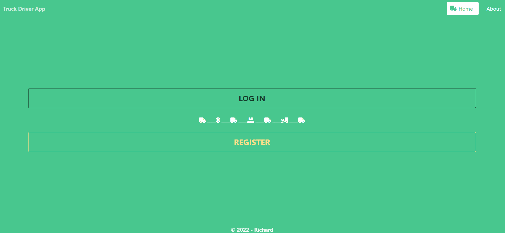
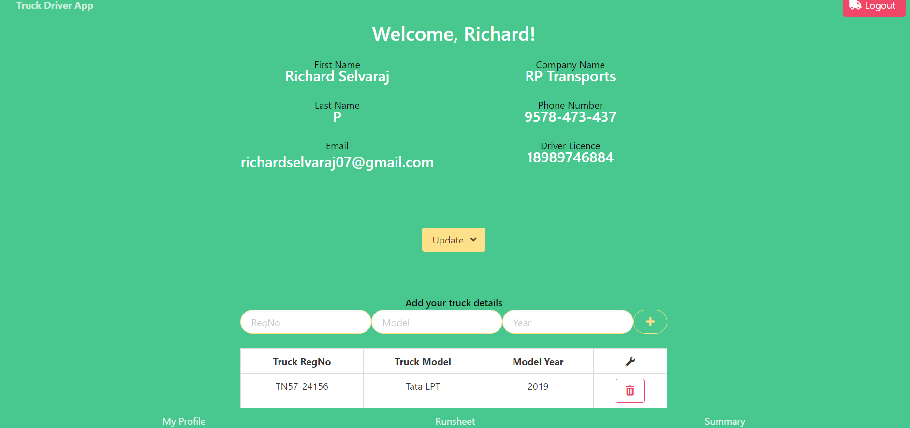
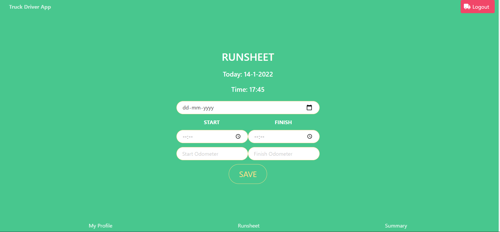
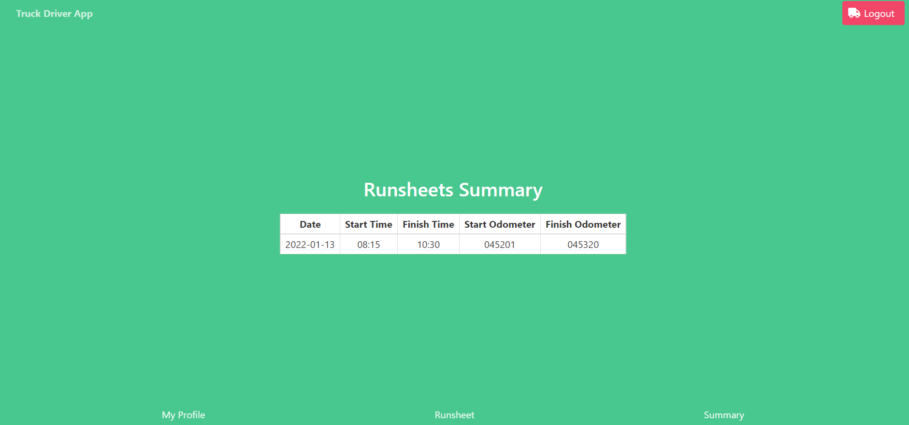

## Description

**Truck Driver App** is created in aim to help drivers to move to the digital world from paper and pen. After 10 years as a Operation Coordinator and Fleet Controller in Freight Forwarding companies I am trying to build and ultimate app that will help drivers to keep all information accessible at any time about their runs and trucks. **_PS: more fuctions and features will be added in near future._**

This APP is a MERN stack single-page application with use of React for the front end, GraphQL with a Node.js and Express.js on back end, and MongoDB with the Mongoose ODM for the database. It uses queries and mutations for retrieving, adding, updating, and deleting data. Plus has user authentication (JWT).

## Live URL

https://truckdriverapp.herokuapp.com

### _Demo_

The screenshots below show the website previews:

### _Installation_

1. Download or clone repository.
2. [**Node.js**](https://nodejs.org/en/about/) and [**MongoDB**](https://www.mongodb.com/try/download/community) are required to run the application.
3. Run `npm install` in the Terminal to install the required npm packages

### _Usage_

- To start using the application, input the following in your Terminal

  `npm run dev`
